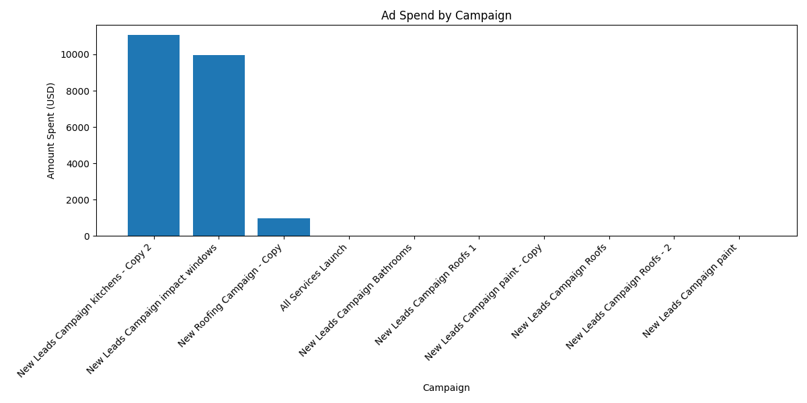
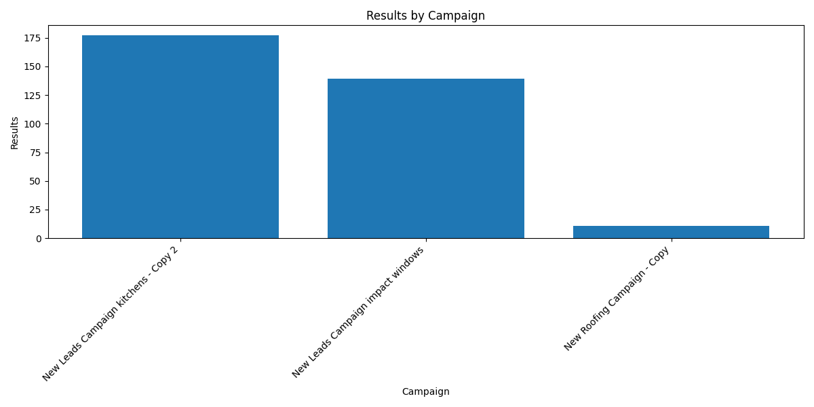

# Business Cost Intelligence Platform

## Project Goal

This project analyzes real-world marketing and sales pipeline data from contractor lead generation campaigns.

The goal is to identify:
- campaign efficiency
- funnel bottlenecks
- revenue opportunities
- marketing ROI
- pipeline performance

using Python, Pandas, SQLite, SQL, and business analytics workflows.

---

## Tech Stack

- Python
- Pandas
- SQLite
- SQL
- Jupyter Notebook
- Matplotlib
- GitHub
- CSV / CRM exports
- Marketing Analytics
- Revenue Operations Analytics

---

## Datasets

The project uses:
- CRM opportunity data
- contact data
- Facebook Ads campaign data

---

## Key KPIs

- Total Contacts
- Total Opportunities
- Total Ad Spend
- Cost Per Result
- Estimated ROAS
- Opportunity Conversion Rate
- Pipeline Stage Distribution

---

## Key Business Insights

### 1. Strong Positive Correlation Between Spend and Results
Higher ad spend consistently generated more campaign results.

### 2. Kitchen Campaigns Performed Best
Kitchen campaigns generated the highest volume of results while maintaining relatively efficient cost-per-result metrics.

### 3. Roofing Campaigns Showed Lower Efficiency
Roofing campaigns produced fewer results with higher acquisition costs.

### 4. Major Funnel Drop-Off Detected
A significant number of contacts did not progress into opportunities, indicating potential lead quality or follow-up issues.

### 5. Most Pipeline Value Was Concentrated in Closed Deals
Revenue forecasting visibility across earlier pipeline stages was limited.

### 6. Large Volume of Disqualified Leads
Most opportunities were marked as "Not Interested / Disqualified", suggesting optimization opportunities in targeting and qualification processes.

---

## Funnel Analysis

The project includes:
- contact-to-opportunity funnel analysis
- campaign performance analysis
- revenue distribution analysis
- pipeline stage analysis
- KPI dashboards

---

## Sample Visualizations

### Ad Spend by Campaign



### Results by Campaign



### Pipeline Stage Distribution


### Revenue by Pipeline Stage


---

## Data Pipeline

```text
Facebook Ads + CRM Exports
        ↓
Python / Pandas Data Cleaning
        ↓
SQLite Database
        ↓
SQL Business Queries
        ↓
KPI Analysis & Visualizations
        ↓
Business Intelligence Reporting
```

---

## SQL Analytics Examples

### Top Performing Campaigns

```sql
SELECT
    campaign_name,
    SUM(amount_spent_usd) AS total_spend,
    SUM(results) AS total_results
FROM campaigns
GROUP BY campaign_name
ORDER BY total_results DESC;
```

### Pipeline Distribution

```sql
SELECT
    stage,
    COUNT(*) AS total_opportunities
FROM opportunities
GROUP BY stage
ORDER BY total_opportunities DESC;
```

---

## Key Findings

- Kitchen campaigns generated the strongest performance and most efficient results.
- Roofing campaigns showed lower efficiency and higher acquisition costs.
- Significant funnel drop-offs were detected between contacts and opportunities.
- Most revenue value was concentrated in closed pipeline stages.
- Strong positive correlation was identified between ad spend and campaign results.

---

## Skills Demonstrated

- Data Cleaning
- Exploratory Data Analysis (EDA)
- SQL Querying
- KPI Analysis
- Funnel Analytics
- Revenue Operations Analytics
- Data Visualization
- Business Intelligence Reporting
- Git & GitHub Workflow
- SQLite Database Management

---

## Future Improvements

- BigQuery integration
- Looker Studio dashboards
- automated ETL pipelines
- anomaly detection
- forecasting models
- cloud data warehouse architecture
